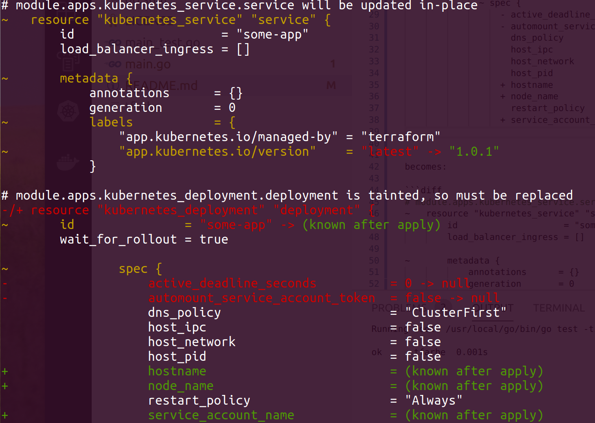

# tfarbe
Add color to Terraform 12 plan output.

Inspired from: https://github.com/coinbase/terraform-landscape

**NOTE**: if you're using terraform v11, tfarbe will not help and you should use `terraform-landscape`.

### Example of output



Also formats the ouput for markdown diff.

For example, this:
```
  # module.apps.kubernetes_deployment.deployment is tainted, so must be replaced
-/+ resource "kubernetes_deployment" "deployment" {
      ~ id               = "some-app" -> (known after apply)
        wait_for_rollout = true

              ~ spec {
                  - active_deadline_seconds          = 0 -> null
                  - automount_service_account_token  = false -> null
                    dns_policy                       = "ClusterFirst"
                    host_ipc                         = false
                    host_network                     = false
                    host_pid                         = false
                  + hostname                         = (known after apply)
                  + node_name                        = (known after apply)
                    restart_policy                   = "Always"
                  + service_account_name             = (known after apply)
```

becomes:

```diff
# module.apps.kubernetes_deployment.deployment is tainted, so must be replaced
-/+ resource "kubernetes_deployment" "deployment" {
~       id               = "some-app" -> (known after apply)
        wait_for_rollout = true

~               spec {
-                   active_deadline_seconds          = 0 -> null
-                   automount_service_account_token  = false -> null
                    dns_policy                       = "ClusterFirst"
                    host_ipc                         = false
                    host_network                     = false
                    host_pid                         = false
+                   hostname                         = (known after apply)
+                   node_name                        = (known after apply)
                    restart_policy                   = "Always"
+                   service_account_name             = (known after apply)
```

## Install

Binaries (should) be available on the [Release page](https://github.com/jeff-knurek/tfarbe/releases/) for both Linux and Mac. You can simple copy one of these binaries to your PATH.

## Usage

```
terraform plan ... | tfarbe
```

### with Docker

```
git clone https://github.com/jeff-knurek/tfarbe.git
cd tfarbe
docker build . -t tfarbe
....
terraform plan ... | docker run -i --rm tfarbe
```

### Helpful bash addition

Add this to your `.bash_profile`/`.bashrc`/`...` accordingly

```
terraform() {
    if [[ $1 == "plan" ]]; then
        command terraform "$@" | docker run --rm -i tfarbe
    else
        command terraform "$@"
    fi
}
```

## License

This project is released under the [MIT license](LICENSE).
